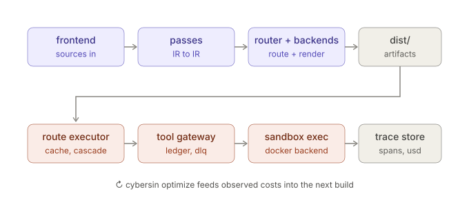

# Cybersin

Cybersin is a Rust-based prompt compiler and durable agent runtime that turns typed prompt sources into optimized, routable, cacheable artifacts. It gives agent developers one CLI for deterministic builds, regression evals, sandboxed execution, resumable sessions, cost tracing, and profile-guided optimization.





## Getting Started

### Prerequisites

- Git
- A current stable Rust toolchain (`rustup`, `rustc`, and `cargo`)

Docker is only required for the container-backed sandbox tests; the quickstart below uses the local SQLite runtime.

### Install

Install the published CLI from crates.io:

```sh
cargo install cybersin
```

Then check the installed binary and command surface:

```sh
cybersin --help
```

To update an existing install later:

```sh
cargo install cybersin --force
```

For contributor builds from source:

```sh
git clone https://github.com/blokboy/cybersin.git
cd cybersin
cargo build --workspace
```

### Create a Project

`cybersin init <dir>` creates the basic Cybersin project spine. It creates
the directory if needed, writes the portable project files, and leaves prompt
sources and build output empty until you add them.

Preview the scaffold first:

```sh
cybersin init myagent
```
The scaffold is intentionally minimal:

```text
myagent/
  cybersin.yaml                 # portable project config
  cybersin.lock                 # pinned model/cost/pass data
  cybersin.local.example.yaml   # example machine-local runtime config
  .gitignore                    # ignores local state, local config, dist
  prompts/                      # prompt sources live here
  fragments/                    # included markdown/json snippets
  evals/                        # regression eval fixtures
  agents/                       # live agent harness configs
  tools/                        # custom tool executables/assets
```

Plain `init` is safe for an existing codebase: existing files are skipped and
reported in the command output. Use `--force` only when you intentionally want
to overwrite scaffold files.

```sh
cat > .env <<'EOF'
OPENROUTER_API_KEY=...
EOF
```

Create `.env` before running `cybersin setup` if you want the setup readiness
report to pass on the first try. The golden path commands stay the same; the
key is local machine input, not a portable project file.

### Run the Golden Path

For a new project, the simple setup path is:

```sh
cybersin init .
cybersin setup
cybersin convert "Write a concise project brief for durable agent runtimes."
cybersin build
cybersin run
```

Those are the only required workflow commands. A successful `convert` writes
and validates a prompt source under `prompts/`; `build` validates what it
compiles into `dist/`; and `run` can infer the built-in starter harness when
there is exactly one compiled prompt and no explicit `agents/*.agent.yaml`
target.

`cybersin setup` creates or updates `cybersin.local.yaml`, loads a project-root
`.env` if present, and then runs the same readiness report as `cybersin
doctor`. By default it records OpenRouter as the live provider, keeps the
scaffolded `stub` provider allowed for generated starter/default artifacts,
and stores API-key references instead of raw secrets:

```yaml
providers:
  openrouter:
    availability: available
    api_key: ${OPENROUTER_API_KEY}
defaults:
  provider: openrouter
  model: openai/gpt-4o-mini
permissions:
  routing:
    allowed_providers: [openrouter, stub]
```

Put the actual key in your shell or in the project `.env`:

`cybersin.local.yaml` and `.env` are gitignored by the scaffold. Raw secrets in
local YAML are a deliberate opt-in in the local-config model; the current
`cybersin setup` command only writes environment-variable references and rejects
`--raw-openrouter-api-key`.

Use `cybersin doctor` any time setup or a focused command says the project is
not ready. It reports project spine, provider keys, local config, build
artifacts, runtime, trace/cost, and sandbox readiness with next actions.

### Optional Starter Template

Plain `cybersin init .` creates only the basic project spine. If you want a
complete runnable loop immediately without first using `convert`, opt into the
starter template:

```sh
cybersin init myagent --template starter
cd myagent
cybersin setup
cybersin build
cybersin run --input inputs/cybersin-starter.input.json
```

The starter template keeps its prompt, fragment, eval, and sample input names
under the `cybersin-starter` prefix. It does not add a user-authored harness
file; after `build`, `cybersin run` uses the built-in starter harness for the
single compiled prompt.

The generated `cybersin.yaml` starts with local SQLite storage, a conservative
static cost model, and the container sandbox backend:

```yaml
name: myagent
targets:
  - generic
cost_model:
  cache_similarity_threshold: 0.97
  judge_trigger_band: [0.90, 0.97]
  judge_model: cache-judge
storage:
  backend: sqlite
sandbox:
  backend: docker+gvisor
```

### Check, Build Profiles, and Release Builds

`cybersin check <path>` is still available for CI, manual preflight, and
hand-edited prompt sources, but it is not required after a successful
`cybersin convert`. The happy path is `convert`, `build`, then `run`.

`cybersin build` defaults to the dev profile:

```sh
cybersin build
```

That is the local iteration mode: it validates prompt sources and writes
normal build artifacts without model-assisted release work. Use the explicit
release profile when you are preparing production artifacts:

```sh
cybersin build --profile release
```

Use frozen release builds in CI or reviewable artifact generation, where any
network/model-assisted pass must already be pinned in `cybersin.lock`:

```sh
cybersin build --profile release --frozen
```

Runtime commands discover the project root by walking up from the current
directory until they find `cybersin.yaml`. That means defaults such as
`.cybersin/cybersin.db`, `.cybersin/sandbox`, and `dist/` resolve relative to
the initialized project unless you override them with CLI flags.

### Local Config Details

For live providers and built-in web tools, keep machine-local readiness
settings out of the portable project config. A fuller local config can declare
provider/tool availability, sandbox defaults, and routing/tool permissions:

```yaml
providers:
  openrouter:
    availability: available
    api_key: ${OPENROUTER_API_KEY}
tools:
  tavily:
    availability: auto
    api_key:
      env: TAVILY_API_KEY
defaults:
  provider: openrouter
  model: openai/gpt-4o-mini
permissions:
  routing:
    allowed_providers: [openrouter]
```

Cybersin still honors the ambient process environment, and it loads optional
project-root `.env` values before OpenRouter and Tavily readiness checks
without overriding variables that are already set.

### Build and run the sample project

Clone the repository if you want to try the included research-team fixture:

```sh
git clone https://github.com/blokboy/cybersin.git
cd cybersin
```

Check and compile the sample project:

```sh
cybersin check fixtures/ic1-research-team
cybersin build fixtures/ic1-research-team \
  --profile release \
  --frozen
```

Run the compiled project. The runtime automatically creates and uses the SQLite database at `.cybersin/cybersin.db`.

```sh
cybersin \
  --db .cybersin/cybersin.db \
  run \
  --stub \
  --dist fixtures/ic1-research-team/dist \
  --session-id quickstart \
  --agent research-team
```

Inspect the compiled routing, token counts, traces, and observed cost:

```sh
cybersin \
  --db .cybersin/cybersin.db \
  explain researcher fixtures/ic1-research-team \
  --plain
```

Run the sample project's recorded regression suite:

```sh
cybersin eval gate fixtures/ic1-research-team
```

### Interactive shell and help

Run `cybersin` with no arguments from an interactive terminal to open the
Ratatui application shell. The first workflow is prompt conversion: enter
a multiline raw prompt, keep or change the standalone conversion model,
optionally set an output path, and run the same conversion pipeline used
by `cybersin convert`. Live conversion uses OpenRouter and reads its key
from the environment directly or through the project's `.env` and
`cybersin.local.yaml` provider config.

Use `cybersin -help`, `cybersin -h`, or `cybersin --help` to print CLI
help and exit. Bare `cybersin` in a non-interactive context fails clearly
instead of waiting on terminal UI input.

### Live tool execution

Custom tools declared with `run:` and an optional container `image:` are
compiled into `dist/tools.json`; files under the project's `tools/`
directory are packaged into `dist/tools/`. DLQ retries and approved calls
execute those commands in the selected Docker sandbox:

```sh
cybersin \
  --dist fixtures/ic1-research-team/dist \
  --sandbox-backend docker \
  dlq retry '<call-id>'
```

Network egress allowlisting is not implemented yet. A tool whose agent
declares a non-empty `sandbox.egress` fails closed before a container is
started. The `web_search` built-in is recognized but likewise fails
clearly until a search provider is configured.

For the full product design and command surface, see [cybersin-spec.md](cybersin-spec.md).
